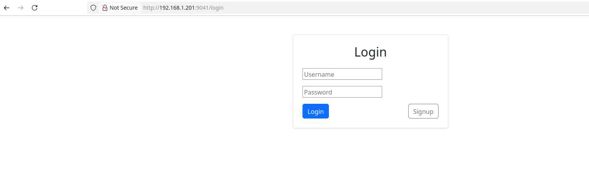
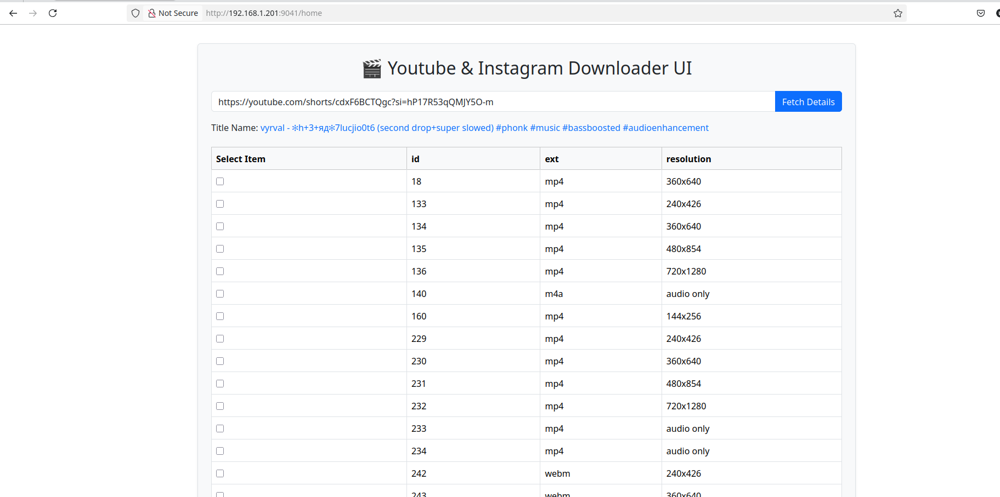

## Youtube And Instagram Downloader 

### Tools Used

* React 
* MongoDB
* Fast API

## Screen Shots 

## URLS 

 - http://0.0.0.0:9041/history
 - http://0.0.0.0:9041/home
 - http://0.0.0.0:9041/login
 - http://0.0.0.0:9041/signup

## Setup

Add environment variable HOSTIP in Host machine
export HOSTIP=$(ip -4 addr show wlp44s0 | grep -oP '(?<=inet\s)\d+(\.\d+){3}')